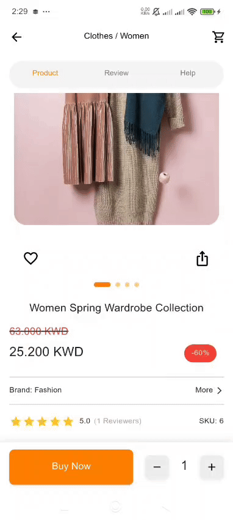

# 🛍️ Product Details App

A modern Flutter application showcasing product details with a clean architecture approach. This app provides an elegant user interface for viewing product information, reviews, and related items.

---

## 📋 Project Overview

This Flutter application demonstrates best practices in mobile app development by implementing a product details screen with multiple tabs, dynamic pricing calculations, image caching, and a responsive design. The app fetches product data from a REST API and presents it in an intuitive, user-friendly interface.

---

## 🚀 Tech Stack

- **Flutter** - UI framework for building natively compiled applications
- **Dart** - Programming language
- **flutter_bloc** - State management using the BLoC pattern
- **http** - HTTP client for API requests
- **cached_network_image** - Efficient image loading and caching
- **shimmer** - Loading placeholder animations
- **flutter_rating_bar** - Star rating display widget
- **equatable** - Value equality for state management

---

## 🏗️ Architecture

The project follows Clean Architecture principles with clear separation of concerns:

```
lib/
├── core/                      # Core utilities
│   └── api_service.dart       # HTTP client wrapper
├── features/
│   └── product_details/       # Product details feature
│       ├── cubit/             # State management
│       ├── data/              # Data layer
│       │   ├── models/        # Data models
│       │   └── repository/    # Repository pattern
│       ├── screens/           # UI screens
│       ├── utils/             # Utility functions
│       └── widgets/           # Reusable widgets
└── main.dart                  # App entry point
```

### Architecture Layers

- **Presentation Layer** - UI components, screens, and widgets
- **Business Logic Layer** - BLoC/Cubit for state management
- **Data Layer** - Repository pattern and API service
- **Models** - Data transfer objects and entities

---

## ✨ Features

### 🎯 Core Features

**Product Information Display**
- High-quality product images with loading states
- Product name, brand, and SKU
- Star ratings with reviewer count
- Detailed product descriptions

**Dynamic Pricing**
- Original and discounted prices
- Automatic discount percentage calculation
- Price validation and formatting
- KWD currency support

**Multi-Tab Interface**
- Product details tab
- Reviews tab with user feedback
- Help & support tab
- Smooth tab transitions

**Review System**
- User reviews with ratings
- Avatar generation from usernames
- Relative time formatting (e.g., "2 days ago")
- Clean card-based review layout

**Related Products**
- Category-based product recommendations
- Responsive grid layout (2 or 4 columns)
- Add to cart functionality
- Favorite/wishlist toggle

### 🎨 UI/UX Features

- Loading states with shimmer effects
- Error handling with user-friendly messages
- Expandable/collapsible description section
- Quantity selector for purchases
- Image carousel indicators
- Responsive design for different screen sizes
- Smooth animations and transitions

### 🔧 Technical Features

- Image caching for improved performance
- API error handling
- State persistence during navigation
- Null-safe code
- Optimized network requests

### 🎯Assumptions Made

- API Availability: The API endpoint (https://task-two-plum-44.vercel.app/api) is always available and returns valid JSON responses.
- Price Data: The API may return swapped price values (discount price > original price), so the app includes logic to automatically correct this
- Product ID: The app is hardcoded to display product with ID 6. In a production app, this would be passed dynamically.
- Image Placeholder: If product images fail to load, a local placeholder asset (assets/images/no_image.jpg) is displayed.
- Currency: All prices are displayed in KWD (Kuwaiti Dinar) with 3 decimal places
- Related Products: Products are considered "related" if they belong to the same category as the current product.
- Network Connection: The app assumes an active internet connection. No offline mode is implemented.

---

## 📁 Folder Structure

```
product_details_task/
│
├── lib/
│   ├── core/
│   │   └── api_service.dart
│   │
│   ├── features/
│   │   └── product_details/
│   │       ├── cubit/
│   │       │   ├── product_details_cubit.dart
│   │       │   └── product_details_state.dart
│   │       │
│   │       ├── data/
│   │       │   ├── models/
│   │       │   │   ├── category_model.dart
│   │       │   │   ├── product_model.dart
│   │       │   │   └── review_model.dart
│   │       │   └── repository/
│   │       │       └── product_repo.dart
│   │       │
│   │       ├── screens/
│   │       │   ├── help_screen.dart
│   │       │   ├── product_details_screen.dart
│   │       │   └── review_screen.dart
│   │       │
│   │       ├── utils/
│   │       │   └── price_calculator.dart
│   │       │
│   │       └── widgets/
│   │           ├── bottom_buy_bar.dart
│   │           ├── custom_tab_bar.dart
│   │           ├── description_section.dart
│   │           ├── price_section.dart
│   │           ├── product_image_section.dart
│   │           ├── product_tab.dart
│   │           ├── related_products_section.dart
│   │           └── similar_product_card.dart
│   │
│   └── main.dart
│
├── assets/
│   └── images/
│       └── no_image.jpg
│
└── pubspec.yaml
```

---

## 🧪 Testing

Currently, the project focuses on manual testing. Future iterations will include:

- Unit tests for business logic
- Widget tests for UI components
- Integration tests for user flows
- API mocking for reliable testing

---

## 🎯 How to Run the Project

### Prerequisites

- Flutter SDK (3.0 or higher)
- Dart SDK (3.0 or higher)
- Android Studio / VS Code with Flutter extensions
- An Android emulator or iOS simulator / Physical device

### Installation Steps

1. Clone the repository
```bash
git clone <repository-url>
cd product_details_task
```

2. Install dependencies
```bash
flutter pub get
```

3. Run the app
```bash
flutter run
```

### API Configuration

The app connects to:
- **Base URL:** `https://task-two-plum-44.vercel.app/api`
- **Endpoints used:**
    - `GET /products/` - Fetch all products
    - `GET /products/{id}/` - Fetch specific product details

## 🪄 App Preview


---

## 🔮 Future Improvements

### Planned Features

- Search functionality across products
- Filter products by category, price, brand
- Shopping cart implementation
- User authentication & profiles
- Wishlist persistence with local storage
- Product comparison feature
- Share product via social media
- Dark mode support
- Localization (multi-language support)
- Offline mode with cached data

### Technical Enhancements

- Add comprehensive unit & widget tests
- Implement CI/CD pipeline
- Add analytics and crash reporting
- Performance monitoring
- Accessibility improvements
- Add pagination for product lists
- Implement proper error logging
- Add loading skeletons instead of spinners
- Optimize build size

### UI/UX Improvements

- Add product image zoom functionality
- Implement image carousel with swipe
- Add size/color selection for products
- Enhanced animations and micro-interactions
- Bottom sheet for quick add to cart
- Pull-to-refresh functionality

---

## 📸 Screenshots

| Home Screen                                          | Product Details | Reviews |
|------------------------------------------------------|----------------|---------|
|  |  |  |

---

## 🤝 Contributing

Contributions are welcome! Please feel free to submit a Pull Request.

1. Fork the project
2. Create your feature branch (`git checkout -b feature/AmazingFeature`)
3. Commit your changes (`git commit -m 'Add some AmazingFeature'`)
4. Push to the branch (`git push origin feature/AmazingFeature`)
5. Open a Pull Request

---

## 📄 License

This project is open source and available under the MIT License.

---

## 👨‍💻 Developer

**Soha Ahmed**

- GitHub: [@yourusername](https://github.com/yourusername)
- LinkedIn: [Your Name](https://linkedin.com/in/yourname)


---

## 🙏 Acknowledgments

- Flutter team for the amazing framework
- BLoC library contributors
- Open source community

⭐ If you found this project helpful, please consider giving it a star!  
Made with ❤️ using Flutter

